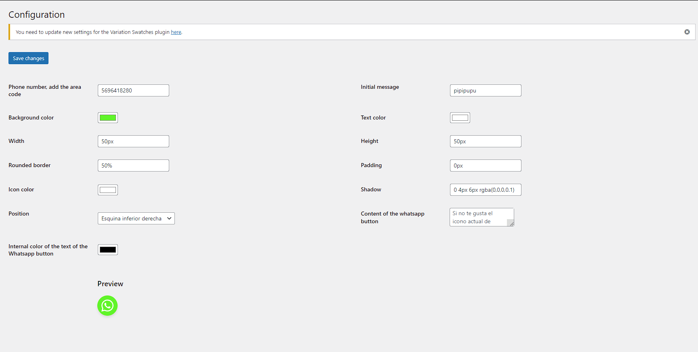
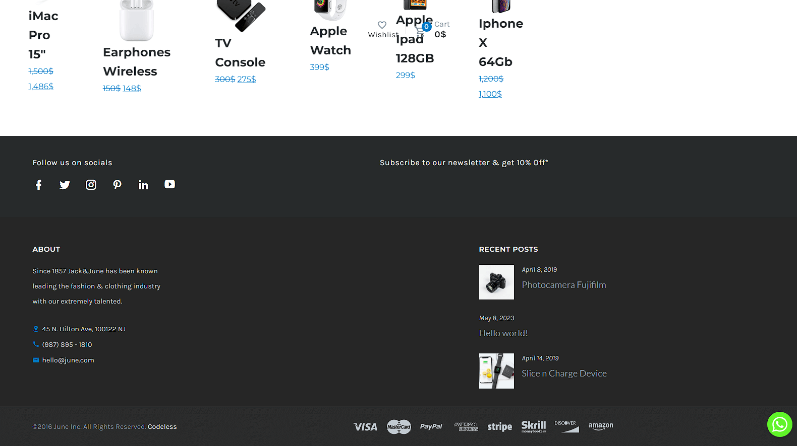

# WhatsApp Button Plugin for WordPress

Este es un plugin de WordPress que permite a los usuarios agregar un botón de WhatsApp a su sitio web. Este botón llevará a los visitantes directamente a una conversación de WhatsApp con el número de teléfono configurado.

## Instalación

1. Descarga el archivo ZIP del plugin y descomprímelo.
2. Sube la carpeta extraída a tu directorio `/wp-content/plugins/`.
3. Navega a la sección de 'Plugins' en tu panel de administración de WordPress y activa el plugin 'WhatsApp Button'.

## Uso

Una vez instalado y activado, puedes configurar el botón de WhatsApp desde la página de opciones del plugin. Los siguientes ajustes están disponibles:

- Número de teléfono de WhatsApp
- Mensaje inicial
- Color de fondo del botón
- Color del texto del botón
- Posición del botón (inferior-derecha, inferior-izquierda)
- Ancho del botón
- Altura del botón
- Radio de la frontera del botón
- Color del SVG (icono de WhatsApp)
- Sombra de la caja del botón
- Contenido personalizado en el botón (puedes agregar un SVG personalizado aquí)

Todos estos ajustes tienen valores predeterminados, por lo que el botón de WhatsApp aparecerá en tu sitio incluso si no cambias ninguna configuración.

## Capturas de pantalla

A continuación, se muestran algunas capturas de pantalla de la funcionalidad del plugin.

### Configuración del Plugin

Aquí puedes ver la página de configuración del plugin. Esto es accesible a través del panel de administración de WordPress.

### Botón de WhatsApp en acción

Este es el botón de WhatsApp como se ve en un sitio web. Tenga en cuenta que la apariencia puede variar dependiendo de las opciones de configuración.

## Soporte

Si tienes alguna pregunta o problema con el plugin, puedes abrir un issue en este repositorio de GitHub.

## Contribuir

Las contribuciones son bienvenidas. Si tienes una mejora o un arreglo para el plugin, por favor abre un pull request.

## Licencia

Este plugin de WordPress está disponible bajo la licencia GPL v2 o posterior.
